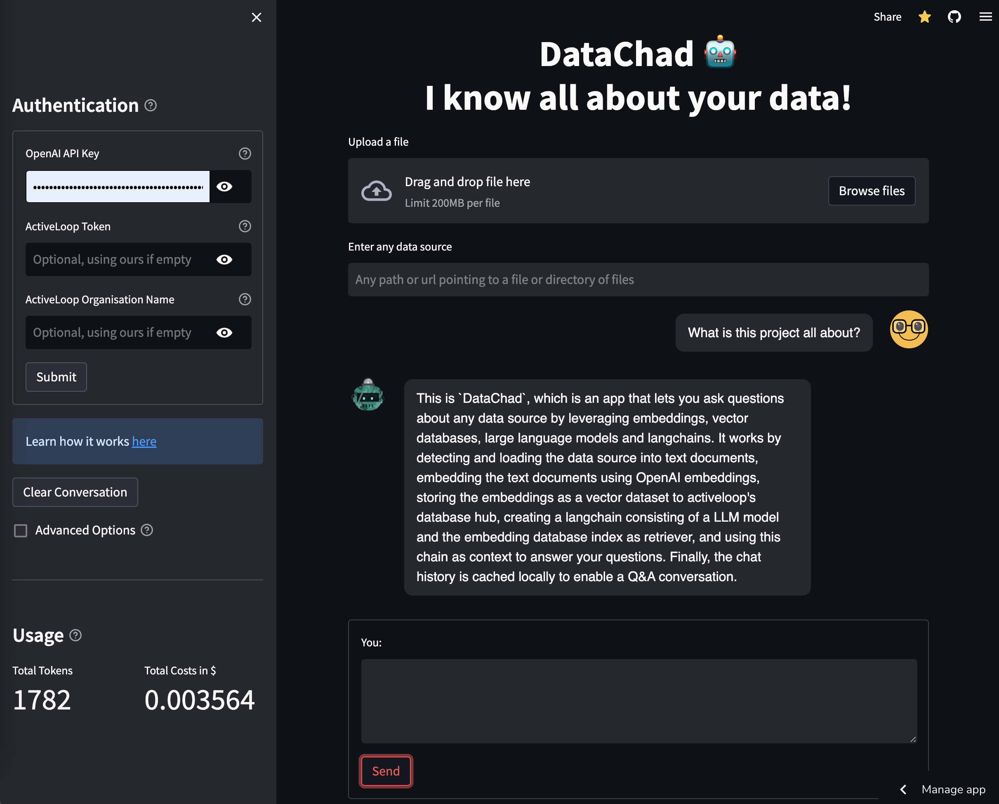

# DataChad 🤖

This is an app that let's you ask questions about any data source by leveraging [embeddings](https://platform.openai.com/docs/guides/embeddings), [vector databases](https://www.activeloop.ai/), [large language models](https://platform.openai.com/docs/models/gpt-3-5) and last but not least [langchains](https://github.com/hwchase17/langchain)

## How does it work?

1. Upload any `file` or enter any `path` or `url`
2. The data source is detected and loaded into text documents
3. The text documents are embedded using openai embeddings
4. The embeddings are stored as a vector dataset to activeloop's database hub
5. A langchain is created consisting of a LLM model (`gpt-3.5-turbo` by default) and the embedding database index as retriever
6. When sending questions to the bot this chain is used as context to answer your questions
7. Finally the chat history is cached locally to enable a [ChatGPT](https://chat.openai.com/) like Q&A conversation

## Good to know

- As default context this git repository is taken so you can directly start asking question about its functionality without chosing an own data source.
- To run locally or deploy somewhere, execute `cp .env.template .env` and set credentials in the newly created .env file. Other options are manually setting of system environment variables, or storing them into `.streamlit/secrets.toml`.
- Your data won't load? Feel free to open an Issue or PR and contribute!
- Yes, Chad in `DataChad` refers to the well-known [meme](https://www.google.com/search?q=chad+meme)

## How does it look like?

